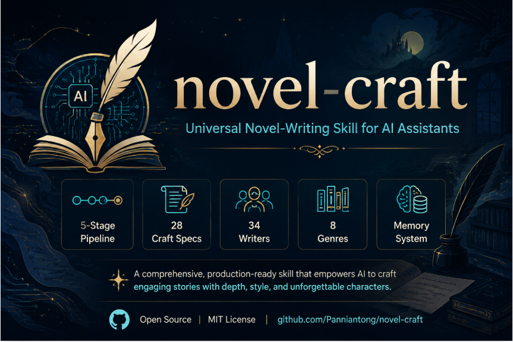

<p align="center">
  
</p>

# novel-craft · 通用小说创作 Skill / Universal Novel-Writing Skill

> 一个面向 AI 编程助手的**通用小说创作技能包**——覆盖从灵感到发布的全流程：访谈定题 → 资料拆分 → 规格技法 → 逐章写作 → 修订发布。支持各类题材与篇幅（短篇/中篇/长篇），适用于 Claude Code / OpenCode / CodeBuddy 等支持 skill 的编程助手。
>
> A **universal novel-writing skill pack** for AI coding assistants — covering the full pipeline from idea to publication: interview → setup → craft specs → chapter writing → revision & release. Supports all genres and lengths (short/medium/long). Works with Claude Code, OpenCode, CodeBuddy, and other skill-enabled assistants.

---

## 特性 / Features

| 中文 | English |
|---|---|
| **Agent 架构**：主控编排 + 7 个专业子代理（访谈/资料/写作/敏感场景/审查/发布/记忆） | **Agent architecture**: orchestrator + 7 specialist subagents (interview / setup / writing / sensitive-scenes / review / release / memory) |
| **五层流程**：访谈 → 资料拆分 → 规格技法 → 写作循环 → 修订与发布 | **5-stage pipeline**: Interview → Setup → Craft Specs → Writing Loop → Revision & Release |
| **31 份规格文档**：视角/人物/描写/节奏/风格/反AI/世界观/爽点/修订/市场/平台…… | **31 craft spec documents**: POV / character / description / pacing / style / anti-AI / worldbuilding / payoff / revision / market / platform… |
| **独立质检**：完稿审查官逐段十七维度过筛（不写只审） | **Independent QA**: reviewer screens every paragraph via 17 dimensions |
| **记忆共享**：记忆官维护连续性（圣经/时间线/伏笔/爽点/canon/issues） | **Shared memory**: memory keeper maintains continuity (bible / timeline / foreshadowing / payoff / canon / issues) |
| **34 位作家技法库**：世界 12 + 中国 12 + 网文 10 | **34-writer technique library**: 12 world + 12 Chinese + 10 web-novel |
| **8 大类型风格**：仙侠/古典/修真/武侠/玄幻/耽美/架空/穿越 | **8 genre styles**: xianxia / classical / xiuzhen / wuxia / xuanhuan / danmei / alternate / transmigration |
| **检查脚本**：禁词/转述词/字数自动校验 | **Check script**: auto-verify banned words / POV leaks / word count |
| **避坑清单**：13 类常见错误沉淀 | **Pitfalls list**: 13 categories of hard-won mistakes |
| **全流程覆盖**：写什么→怎么写→发哪里 | **Full pipeline**: what → how → where (revision / submission / platform) |
| **NSFW 支持**：按受众尺度路由（全年龄/成人向） | **NSFW support**: routed by audience rating (all-ages / adult) |

---

## 安装 / Installation

将本目录放入项目的 skill 目录，或复制到你的 skill 配置路径：

Place this directory into your project's skill folder, or copy to your skill config path:

```bash
# 示例：放入项目的 .skill 目录 / Example: into a project's .skill dir
cp -r novel-craft /your-project/.skill/
```

### CodeBuddy 安装 / Install for CodeBuddy

CodeBuddy 以 `SKILL.md` 为入口自动识别技能，无需复制 `agents/` 子代理文件（主控按本文件五层流程直接编排；`agents/` 下的 7 份角色定义可随时作为委派说明传给 CodeBuddy 子代理）：

Copy the skill into CodeBuddy's skills folder; CodeBuddy auto-detects `SKILL.md` (no separate agent dir needed):

```bash
# 用户级（所有项目可用）/ user scope — available in every workspace
cp -r novel-craft ~/.codebuddy/skills/

# 或项目级 / or project scope — committed with the repo
cp -r novel-craft /your-project/.codebuddy/skills/
```

### 启用 Agent 架构 / Enable agent architecture

7 个子代理定义在 `agents/` 下，复制到运行时的 agent 目录：

Copy the 7 subagent definitions from `agents/` to your runtime's agent directory:

```bash
# OpenCode: project agents
cp -r agents/. /your-project/.opencode/agent/
# 或全局 / or global
cp -r agents/. ~/.config/opencode/agent/

# Claude Code: project subagents
cp -r agents/. /your-project/.claude/agents/
# 或全局 / or global
cp -r agents/. ~/.claude/agents/
```

未安装 agents 时（含 CodeBuddy 默认情况），SKILL.md 仍可作为单体 skill 工作（主控直接按规格执行，不派子代理）；`agents/` 下的 7 份角色定义可随时作为委派说明传给子代理。

---

## 快速开始 / Quick Start

1. **首次使用**：让助手读 `SKILL.md`，主控派「访谈立项官」从①访谈开始（问清题材/主角/冲突）
   **First use**: have the assistant read `SKILL.md`; orchestrator dispatches the Interview Architect for ①Interview
2. **写正文前**：主控派「资料架构师」②生成项目文档（风格/世界观/角色/大纲/记忆）
   **Before prose**: orchestrator dispatches Setup Architect for ②Setup
3. **每章写作**：主控派「正文写手」③④写作；涉敏感场景派「敏感场景师」专项
   **Per chapter**: dispatches Novel Writer for ③④; dispatches Sensitive-Scene Specialist for adult scenes
4. **完稿**：主控派「完稿审查官」独立质检 →「记忆官」回写 →「修订发布官」⑤修订/发布
   **Finish**: Reviewer (independent QA) → Memory Keeper (recap) → Release Officer for ⑤

---

## 目录结构 / Directory Structure

```
novel-craft/
├── SKILL.md                  # 主控入口：Agent 编排 + 五层流程 + 规格索引 + 核心铁律
│                             # Orchestrator: agent dispatch + pipeline + spec index + core rules
├── agents/                   # 7 个专业子代理定义（复制到运行时 agent 目录启用）
│                             # 7 specialist subagent definitions (copy to runtime agent dir)
│   ├── interview-architect.md   # 访谈立项官 / Interview Architect
│   ├── setup-architect.md       # 资料架构师 / Setup Architect
│   ├── novel-writer.md          # 正文写手 / Novel Writer
│   ├── scene-specialist.md      # 敏感场景师 / Sensitive-Scene Specialist
│   ├── paragraph-reviewer.md    # 完稿审查官 / Paragraph Reviewer
│   ├── release-officer.md       # 修订发布官 / Release Officer
│   └── memory-keeper.md         # 记忆官 / Memory Keeper
├── README.md                 # 本文档 / This file
├── LICENSE                   # MIT 许可 / MIT License
├── CONTRIBUTING.md           # 贡献指南 / Contribution guide
├── CHANGELOG.md              # 版本记录 / Changelog
├── references/               # 31 份规格文档（按"何时读"路由）
│                             # 31 spec docs (routed by "when to read")
│   ├── 00-interview.md       # 访谈：问清写什么书/写给谁
│   ├── 00b-project-setup.md  # 资料拆分：生成顺序/目录/铁律
│   ├── 00c-genre-docs.md     # 题材→文档自动装配
│   ├── 01-pov.md             # 视角铁律 / POV rules
│   ├── 02-character.md       # 人物描写 + 社会地位
│   ├── 02b-description-dimensions.md  # 描写维度（风景/建筑/事物/人物八维）
│   ├── 03-pacing.md          # 节奏（七段式/章末钩子）
│   ├── 03b-style.md          # 写作风格 / Style
│   ├── 04-anti-ai.md         # 反AI味 / Anti-AI-flavor
│   ├── 05-sensitive.md       # 暴力/创伤/非自愿
│   ├── 05b-sex-scenes.md     # 性场景（成人向专用，仅当涉及）
│   ├── 06-worldbuilding.md   # 世界观对齐 / Worldbuilding
│   ├── 07-checklists.md      # 完稿检查清单 / Finish checklists
│   ├── 08-hook-payoff.md     # 爽点设计（网文）/ Payoff design
│   ├── 09-export.md          # 完稿导出与发布 / Export & release
│   ├── 10-chapter-split.md   # 章节拆分 / Chapter splitting
│   ├── 11-writers-craft.md   # 作家技法库总索引 / Writers' index
│   ├── 12-genre-styles.md    # 8 大类型风格 / 8 genre styles
│   ├── 13-pitfalls.md        # 避坑清单 / Pitfalls
│   ├── 14-revision.md        # 修订与编辑（五层）/ Revision (5 layers)
│   ├── 15-market-research.md # 市场调研与题材定位 / Market research
│   ├── 16-golden-three.md    # 黄金三章 / Golden three chapters
│   ├── 17-platform.md        # 平台适配与签约 / Platform & contracts
│   ├── 18-story-structure.md # 故事结构模板库 / Story structure templates
│   ├── 19-reader-feedback.md # 读者反馈与Beta阅读 / Beta readers
│   ├── 20-pitch-materials.md # 投稿与发布材料 / Pitch materials
│   ├── 21-update-cadence.md  # 存稿与更新节奏 / Update cadence
│   ├── 22-scene-interaction.md # 场景人物交互（每章必读）/ Scene interaction
│   ├── 23-prose-expression.md  # 文笔表达七维度（每章必读）/ Prose expression
│   ├── 24-group-sex.md         # 自愿多人性场景（仅当涉及）/ Consensual group sex
│   ├── 25-body-anatomy.md      # 人体档案全维度（建档必读）/ Body anatomy archive
│   └── 26-paragraph-review.md  # 段落审查八维度（完稿逐段筛）/ Paragraph review
├── templates/                # 7 份项目文档模板 + 6 份记忆模板
│                             # 7 project templates + 6 memory templates
├── examples/                 # 视角/人物示范 / POV & character examples
├── scripts/
│   └── check-chapter.py      # 章节检查脚本（禁词/字数）
└── 11-writers/               # 作家技法库细目（世界/中国/网文）
```

---

## 使用方法 / Usage

### 推荐流程（助手视角）/ Recommended flow (assistant view)

```
①访谈 → ②资料拆分 → ③规格技法(写作时按需读) → ④写作循环(每章) → ⑤修订与发布
Interview → Setup → Craft Specs (read on demand) → Writing Loop (per chapter) → Revision & Release
```

### 核心铁律 / Core Rules

| 中文 | English |
|---|---|
| 1. 访谈先行——没访谈不写正文 | 1. Interview first — never write without it |
| 2. 资料是唯一真相源——从资料库查，不现场脑补 | 2. Docs are the single source of truth — consult, don't invent |
| 3. 视角=写谁就是谁——人称/称呼/词汇跟随视角人物 | 3. POV = be the character — pronouns/address/words follow them |
| 4. 反AI味——禁词+禁转述词+禁上帝视角 | 4. Anti-AI — banned words / no "she thought" / no omniscience |
| 5. 完稿必核——检查清单逐条勾 | 5. Verify before delivery — check every checklist item |
| 6. 敏感场景路由——按受众尺度决定读哪些规格 | 6. Sensitive-scene routing — specs by audience rating |
| 7. 避坑必查——完稿自审对照避坑清单 | 7. Check pitfalls — self-review against the list |

---

## 贡献 / Contributing

欢迎提交 PR 改进规格文档、补充作家技法、新增类型风格、优化脚本。请保持：

Contributions welcome: PRs improving specs, adding writer techniques, new genre styles, or optimizing scripts. Please keep:

- **通用性**：所有规格只写通用表述，不绑定任何具体作品/项目
  **Generality**: specs use universal language, not tied to any specific work/project
- **层次清晰**：每个规格文档标注"何时读"（每章必读/仅当涉及）
  **Clear routing**: each spec marks "when to read" (every chapter / on demand)
- **可执行**：每条规则带"自检项"，让助手能逐条核对
  **Actionable**: each rule has a self-check item

详见 `CONTRIBUTING.md` / See `CONTRIBUTING.md` for details.

---

## 许可 / License

[MIT](LICENSE) — 开源，欢迎使用与改进 / Open source, free to use and improve.

---

## 致谢 / Credits

- 作家技法库参考多位中外作家与网文作者的公开写作经验
- 结构与节奏参考经典写作方法论（三幕结构 / Save the Cat / 英雄之旅 / 场景-续）
- 实战教训沉淀自真实小说创作项目的迭代
